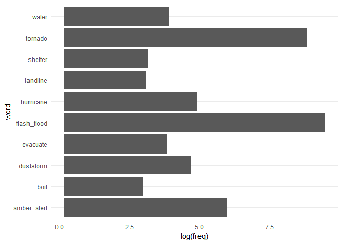
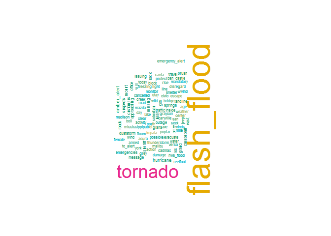
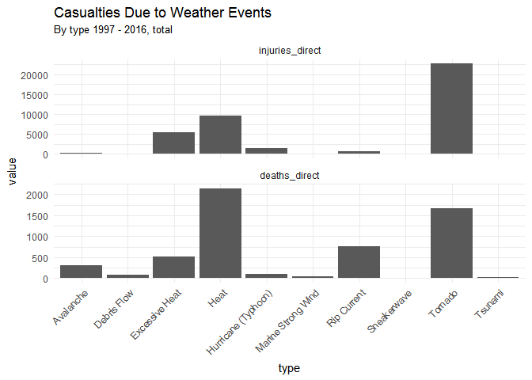
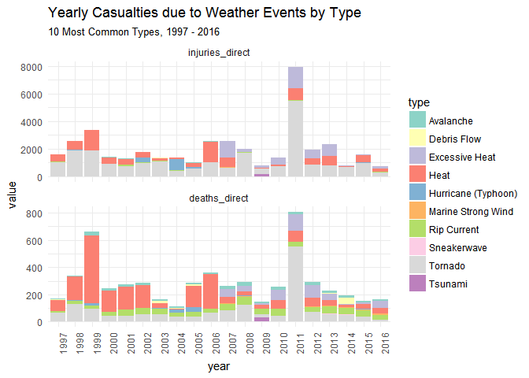
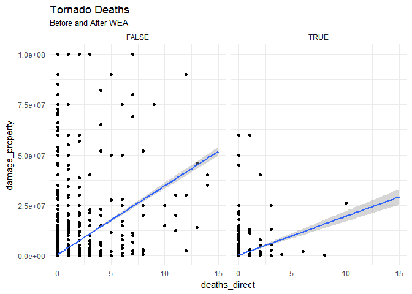
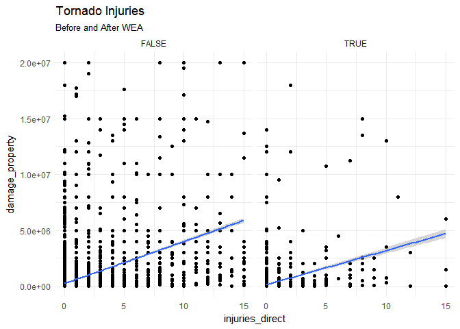
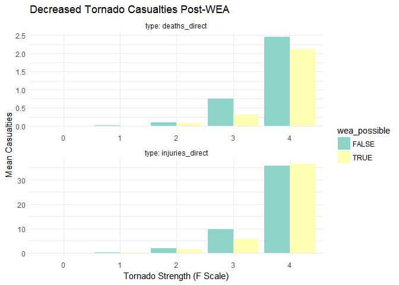

# NOAA Weather Damage Analysis


# Reading Data 

Event information was taken from the  [NOAA](ftp://ftp.ncdc.noaa.gov/pub/data/swdi/stormevents/csvfiles/) database of storm events. The events are downloaded from NOAA when this report is run so that we can get the most recently updated data. 


Then, we will find the types of weather events causing the highest number of injuries and fatalities over the past twenty years. 


```
## # A tibble: 6 × 17
##        id     st     cz       type      begin    tz injuries_direct
##     <int> <fctr> <fctr>     <fctr>     <dttm> <chr>           <int>
## 1 5600565     41  00013      Flood 1997-01-01   PST               0
## 2 5590164     06  00073      Flood 1997-01-01   PST               0
## 3 5590156     32  00001      Flood 1997-01-01   PST              50
## 4 5590157     32  00002      Flood 1997-01-01   PST               0
## 5 5590158     32  00003      Flood 1997-01-01   PST               0
## 6 5615914     30  00001 Heavy Snow 1997-01-01   MST               0
## # ... with 10 more variables: injuries_indirect <int>,
## #   deaths_direct <int>, deaths_indirect <int>, damage_property <dbl>,
## #   damage_crops <dbl>, fscale <fctr>, begin_lat <dbl>, begin_lon <dbl>,
## #   end_lat <dbl>, end_lon <dbl>
```
# Selecting Event Types
With 52 event types, we are only going to focus on the most damaging ones.  I will look at the total of directly-caused, deaths and injuries.


```r
top_death <- top_n(tmp, 10, wt = deaths_direct_mean) %>%
        transmute(type = factor(type)
                  , direct = deaths_direct_sum
                  , indirect = deaths_indirect_sum) %>%
        arrange(desc(direct))

top_injury <- top_n(tmp, 10, wt = injuries_direct_mean) %>%
                transmute(type = factor(type)
                  , direct = injuries_direct_sum
                  , indirect = injuries_indirect_sum) %>%
        arrange(desc(direct))

top_damage <- top_n(tmp, 10, wt = damage_property_mean) %>%
               transmute(type = factor(type)
                  , property = damage_property_sum
                  , crops = damage_crops_sum) %>%
        arrange(desc(property))

print(top_death)
```

```
## # A tibble: 10 × 3
##                   type direct indirect
##                 <fctr>  <int>    <int>
## 1                 Heat   2146       76
## 2              Tornado   1667       29
## 3          Rip Current    756        3
## 4       Excessive Heat    523       70
## 5            Avalanche    314        4
## 6  Hurricane (Typhoon)     98       25
## 7          Debris Flow     90        0
## 8   Marine Strong Wind     45        4
## 9              Tsunami     33        0
## 10         Sneakerwave     12        0
```

```r
print(top_injury)
```

```
## # A tibble: 10 × 3
##                   type direct indirect
##                 <fctr>  <int>    <int>
## 1              Tornado  22679      240
## 2                 Heat   9612      180
## 3       Excessive Heat   5339       56
## 4            Lightning   4510      270
## 5  Hurricane (Typhoon)   1364     2409
## 6          Rip Current    600        1
## 7           Dust Storm    380      250
## 8              Tsunami    131       19
## 9   Marine Strong Wind     34       10
## 10         Sneakerwave     11        0
```

```r
print(top_damage)
```

```
## # A tibble: 10 × 3
##                   type    property      crops
##                 <fctr>       <dbl>      <dbl>
## 1  Hurricane (Typhoon) 84837198310 5128029800
## 2     Storm Surge/Tide 53928224600     950000
## 3                Flood 33606908480 4925620270
## 4              Tornado 30195706510  297753360
## 5        Coastal Flood 21664180360     750000
## 6             Wildfire 10431527560  444592860
## 7       Tropical Storm  8556908350  982021000
## 8            Ice Storm  5738365510   10165000
## 9          Debris Flow   263514700   20001500
## 10             Tsunami   148062000      20000
```

```r
health.10 <- filter(event.damage
                    , type %in% top_death$type) %>%
             mutate(type = factor(type), ordered = TRUE)

health.mean.10 <- select(event.damage,1:8) %>%
        filter(type %in% top_death$type) %>%
        mutate(type = factor(type)) %>%
        group_by(year, type) %>%
        summarize_at(c(5:8), mean)

health.sum.10 <- select(event.damage,1:8) %>%
        filter(type %in% top_death$type) %>%
        mutate(type = factor(type)) %>%
        group_by(year, type) %>%
        summarize_at(c(5:8), sum)

hmean.long <- melt(health.mean.10, id.var = c("year","type")
                ,variable.name = "casualties")

hsum.long <- melt(health.sum.10, id.var = c("year","type")
                ,variable.name = "casualties")
```
# Data Plots
Wireless Emergency Alerts are designed to warn about imminent threats to life or property. By using text analyis tools on a database of all WEA messages sent since May of 2014, we can create a plot of frequency for the different types of messages. The National Weather Service (NWS) uses the WEA messages almost exclusively to warn about tornadoes and flash floods. 

<!-- Attach the text analysis of WEA messages -->

```r
source('C:/Users/amsilverman/Box Sync/@Project Support/WEA_Analysis/NOAA Analysis/textMining.R')
```

<!-- --><!-- -->

The WEA messages are used for these types of weather events because

1. tornadoes and flash floods cause a very high proportion of weather-related casualties and 

1. tornadoes and flash floods are fast-moving and extremely localized events, both of which make WEA messages an ideal medium for warnings. 

# Effects of WEA on Weather-Related Injuries and Deaths

By plotting the casualties caused by similarly-sized tornadoes before and after the advent of WEA, we might see some effect of the warnings on population health. 

We will first use property damage as a proxy for event strength, as the 90-character WEA messages are more likely to help a person move to safety - the short notice that these alerts give are unlikely to give a recipient sufficient time to protect property before a tornado strikes.


```r
# Total Casualties as a result of Weather Events#
 g <- ggplot(data = filter(hsum.long, casualties == "deaths_direct" | casualties == "injuries_direct"), 
            mapping = aes(type, value
                          , facets = casualties
                          , ylim(0,2))
            )

# 
g + geom_bar(stat = "identity", position = "stack") +
        facet_wrap(~casualties, ncol = 1, scales = "free_y") +
        scale_fill_brewer(palette = "Set3") + 
        theme_minimal() + 
        theme(axis.text.x = element_text(angle = 45, hjust = 1)) + 
        ggtitle("Casualties Due to Weather Events", subtitle = "By type 1997 - 2016, total")
```

<!-- -->

```r
# Yearly Casualties as a Direct consequence of Weather Events

g <- ggplot(data = filter(hsum.long, casualties == "deaths_direct" | casualties == "injuries_direct"),
            mapping = aes(year, value
                          , fill = type
                          , facets = casualties
                         # , ylim(0,2)
                          )
        )

# 
g + geom_bar(stat = "identity", position = "stack") +
        facet_wrap(~casualties, nrow = 4, scales = "free_y") + 
        scale_fill_brewer(palette = "Set3") +
        theme_minimal() + 
       theme(axis.text.x = element_text(angle = 90), complete = FALSE) + 
        ggtitle("Yearly Casualties due to Weather Events by Type", subtitle = "10 Most Common Types, 1997 - 2016") 
```

<!-- -->

```r
tornado <- filter(event.damage, type == "Tornado") %>%
                group_by(wea_possible)

m <- ggplot(data =  tornado %>% group_by(wea_possible)
            , mapping = aes(deaths_direct, damage_property
                            , facets = wea_possible)
        )
m + geom_point(na.rm = TRUE) +
        facet_grid(~wea_possible) +
        xlim(0,15) + ylim(0,10^8) + 
        geom_smooth(method = "lm", na.rm = TRUE, fullrange = TRUE) +
        scale_fill_brewer(palette = "Set3") +
        theme_minimal() +
        ggtitle("Tornado Deaths", subtitle = "Before and After WEA")
```

<!-- -->

```r
m <- ggplot(data =  tornado %>% group_by(wea_possible)
            , mapping = aes(injuries_direct, damage_property
                            , facets = wea_possible)
)
m + geom_point(na.rm = TRUE) +
        facet_wrap(~wea_possible) +
        xlim(0,15) + ylim(0,2*10^7) + 
        geom_smooth(method = "lm", na.rm = TRUE, fullrange = TRUE) +
        scale_fill_brewer(palette = "Set3") +
        theme_minimal() +
        ggtitle("Tornado Injuries", subtitle = "Before and After WEA")
```

<!-- -->

## Strength of Tornado (Fscale), vs deaths and injuries 
Total deaths and injuries as functions of property damage seem marginally lower post-WEA, however we can also use the Enhanced Fujita Scale to directly compare the effects of similarly-sized tornadoes. 

Because there has only been one F5 tornado since WEA implementation in 2012 -- the Moore, Oklahoma tornado of May, 2013 which killed 24 and injured 207. Because of the small sample size, F5 tornadoes are omitted from this graph.

```r
library(stringr)
library(reshape2)
tornado <- filter(event.damage, type == "Tornado") %>%
#        select(begin, year:wea_possible) %>%
        mutate(fscale = as.factor(
                str_extract(fscale, "[0-9]"))) %>%
        filter(!is.na(fscale), as.numeric(fscale) <= 5) %>%
        group_by(wea_possible)

big_tornado <- filter(tornado, as.numeric(fscale) > 4)

tornado_summary <- summarise_at(group_by(tornado
                                         , wea_possible
                                         , fscale)
                                , c("deaths_direct"
                                    , "injuries_direct"
                                    # , "deaths_indirect"
                                    # , "injuries_indirect"
                                    )
                                , mean
                                ) %>%        
        filter(as.numeric(fscale) < 6)


tornado_summary <- melt(tornado_summary
     , id.vars = c("wea_possible","fscale")
     , variable.name = "type"
     , value.name = "casualty")

n <- ggplot(data = tornado_summary
             , mapping = aes(fscale
                             , casualty
                             , facets = type
                             , fill = wea_possible
                             ))
n + geom_bar(stat = "identity", position = "dodge") + 
        facet_wrap(~type,nrow = 2 ,labeller = label_both, scales = "free") +
        labs(title = "Decreased Tornado Casualties Post-WEA"
             , x = "Tornado Strength (F Scale)"
             , y = "Mean Casualties") +
        scale_fill_brewer(palette = "Set3") + 
        theme_minimal()
```

<!-- -->

